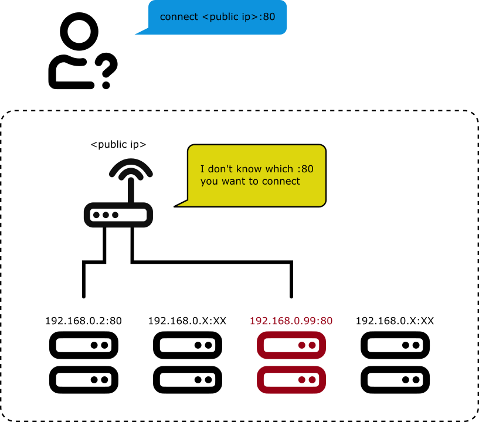
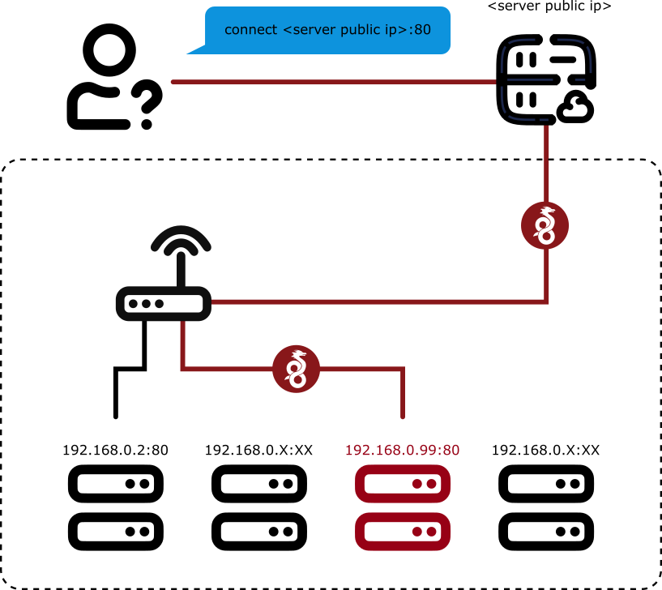

# WireGuard installer for Gaming

**Thank you for all the stars!** I was not aware it was so popular before so I decided to actively maintain it from now.

**This project is a bash script that aims to setup a [WireGuard](https://www.wireguard.com/) VPN that is specified for PERSONAL gaming or torrenting use. It supports only ONE WireGuard client as of now!**

If you are looking for a common WireGuard install script that supports multi-client connections, i.e. multiple devices connect to the VPN at the same time, please visit [this repository](https://github.com/angristan/wireguard-install/) to continue.

## What it does

#### Before using WireGuard



#### After using WireGuard



### NAT Improvement

Client connects to it will immediately achieve a **Full Cone** NAT, the optimal network type for gaming and torrenting. (How to check my NAT type in Win10 ? Use this tool [NatTypeTester](https://github.com/HMBSbige/NatTypeTester)).

With this script, you do not need to enable port forwarding on your router, you do not need the DMZ setting. All the magic happens inside Wireguard. Simply speaking: 

>The local ports will be forwarded to the server directly.

It solves the following scenarios:

1. You want to host a Minecraft/Terraria, etc. server online and play with your friend, but you cannot figure out how to enable port forwarding on your router, or your ISP just did not give you a public IP address.

2. You play a P2P game like Monster Hunter: World or Overcooked! but your NAT type prevents you from connecting with other players. 

For a better gaming experience, the server should be close to your living region and has a low ping value. You should ping the provider's looking glass datacenter IP first before purchasing a VPS.

## Server Public IP problem

This script need to run on a server with a public IP address.

At the beginning of the installation, the script will ask for this public IP address.

Normally the server public IP should be populated automatically, however for some cloud providers like Google Cloud Platform and Oracle Cloud, the auto value is NOT the correct public IP address, but a subnet IP address (usually starts with `10.*.*.*`).

In these cases you need to change the value to what your server's acutal public IP is.

## Port Forwarding

The script **Port Forwards** the local port `53`, `88`, `80`, `500`(4 ports for XBOX LIVE) and `1024-65000` to the corresponding ports on the server side. These ports covered most of the ports used by any games. **Please make sure that there is no other application using these ports on the server, otherwise It will deafen any application that listens to these ports.** I highly suggest running this script on an new empty system. 

Specifically, if the SSH port is inside the range, the script will automatically move it to port `65432` for not losing access to the server after installation.

The script supports both IPv4 and IPv6.

WireGuard does not fit your environment? Check out [openvpn-install](https://github.com/angristan/openvpn-install).

Most part of this script is based on the angristan's [wireguard-install](https://github.com/angristan/wireguard-install/), because I am a new shell programmer so any improvement pull request is welcomed!

## Customize the forwarding ports

The reason why it is full cone is due to the DNAT route rules in the iptables:

After the installation, in `$HOME/.wireguard/rm-fullcone-nat.sh` you can find:

```bash
# PostUp sricpt example
# DNAT 53,80,88,500, 1024 to 65000

### bla bla bla ###
iptables -t nat -A PREROUTING -i ${SERVER_PUB_NIC} -p udp --dport 53 -j DNAT --to-destination ${CLIENT_WG_IPV4}:53
iptables -t nat -A PREROUTING -i ${SERVER_PUB_NIC} -p udp --dport 80 -j DNAT --to-destination ${CLIENT_WG_IPV4}:80
iptables -t nat -A PREROUTING -i ${SERVER_PUB_NIC} -p udp --dport 88 -j DNAT --to-destination ${CLIENT_WG_IPV4}:88
iptables -t nat -A PREROUTING -i ${SERVER_PUB_NIC}-p udp --dport 500 -j DNAT --to-destination ${CLIENT_WG_IPV4}:500
iptables -t nat -A PREROUTING -i ${SERVER_PUB_NIC} -p udp --dport 1024:65000 -j DNAT --to-destination ${CLIENT_WG_IPV4}:1024-65000
iptables -t nat -A PREROUTING -i ${SERVER_PUB_NIC} -p tcp --dport 53 -j DNAT --to-destination ${CLIENT_WG_IPV4}:53
iptables -t nat -A PREROUTING -i ${SERVER_PUB_NIC} -p tcp --dport 80 -j DNAT --to-destination ${CLIENT_WG_IPV4}:80
iptables -t nat -A PREROUTING -i ${SERVER_PUB_NIC} -p tcp --dport 88 -j DNAT --to-destination ${CLIENT_WG_IPV4}:88
iptables -t nat -A PREROUTING -i ${SERVER_PUB_NIC}-p tcp --dport 500 -j DNAT --to-destination ${CLIENT_WG_IPV4}:500
iptables -t nat -A PREROUTING -i ${SERVER_PUB_NIC} -p tcp --dport 1024:65000 -j DNAT --to-destination ${CLIENT_WG_IPV4}:1024-65000

ip6tables -t nat -A PREROUTING -i ${SERVER_PUB_NIC} -p udp --dport 53 -j DNAT --to-destination [${CLIENT_WG_IPV6}]:53
ip6tables -t nat -A PREROUTING -i ${SERVER_PUB_NIC} -p udp --dport 80 -j DNAT --to-destination [${CLIENT_WG_IPV6}]:80
ip6tables -t nat -A PREROUTING -i ${SERVER_PUB_NIC} -p udp --dport 88 -j DNAT --to-destination [${CLIENT_WG_IPV6}]:88
ip6tables -t nat -A PREROUTING -i ${SERVER_PUB_NIC}-p udp --dport 500 -j DNAT --to-destination [${CLIENT_WG_IPV6}]:500
ip6tables -t nat -A PREROUTING -i ${SERVER_PUB_NIC} -p udp --dport 1024:65000 -j DNAT --to-destination [${CLIENT_WG_IPV6}]:1024-65000
ip6tables -t nat -A PREROUTING -i ${SERVER_PUB_NIC} -p tcp --dport 53 -j DNAT --to-destination [${CLIENT_WG_IPV6}]:53
ip6tables -t nat -A PREROUTING -i ${SERVER_PUB_NIC} -p tcp --dport 80 -j DNAT --to-destination [${CLIENT_WG_IPV6}]:80
ip6tables -t nat -A PREROUTING -i ${SERVER_PUB_NIC} -p tcp --dport 88 -j DNAT --to-destination [${CLIENT_WG_IPV6}]:88
ip6tables -t nat -A PREROUTING -i ${SERVER_PUB_NIC}-p tcp --dport 500 -j DNAT --to-destination [${CLIENT_WG_IPV6}]:500
ip6tables -t nat -A PREROUTING -i ${SERVER_PUB_NIC} -p tcp --dport 1024:65000 -j DNAT --to-destination [${CLIENT_WG_IPV6}]:1024-65000
```

If the game needs port that is not covered inside, you can modify the postup and postdown script yourself to add a certain port for it.

* Run the script and **STOP** the wireguard service.
* Modify `add-fullcone-nat.sh`, `rm-fullcone-nat.sh` according to your need.
* Run the script and **RESTART** the wireguard service.
 
## Requirements

Main branch supported distributions:

- Debian >= 11
- Ubuntu >= 20.04 (*Preferred*)

The main branch only works on **KVM** instances. If you are using cloud service from Google, AWS or Oracle, etc. They are based on **KVM** virtualization technology.

Another popular VPS type is **OpenVZ** which usually comes cheaper than **KVM**. If you have this type of machine, unfortunately you cannot run the original WireGuard that requires extra linux kernel module.

However it is still possible to use a userspace WireGuard implementation, for example [wireguard-go](https://github.com/WireGuard/wireguard-go) or [BoringTun](https://github.com/cloudflare/boringtun). Sometimes these userspace implementations are even faster, according to [tests](https://www.reddit.com/r/WireGuard/comments/14r6uf9/i_did_some_benchmarks_of_linux_wireguard/).

### For OpenVZ instances

* Enable TUN/TAP linux driver on your VM management panel, or contact your provider to enable it.
* Compile either [wireguard-go](https://github.com/WireGuard/wireguard-go) or [BoringTun](https://github.com/cloudflare/boringtun).
* Move the compiled binary (either `wireguard-go` or `boringrun-cli`) to `/usr/local/bin`.
* Comment out the installer script line #10-#14, removing the OpenVZ check.
* Run the installer script now.

## Usage

Download and execute the script. You **DO NOT** need to run the script with `root`, but it requires the user to be in the `sudo` group. Answer the questions asked by the script and it will take care of the rest. For most VPS providers, you can just enter through all the questions.

```bash
wget https://raw.githubusercontent.com/xiahualiu/wg_gaming_installer/main/wg-gaming-installer.sh 
bash ./wg-gaming-installer.sh
```

It will install WireGuard (kernel module and tools) on the server, configure it, create a systemd service and a client configuration file.

## Stop / Restart / Uninstal

Run the script again will give you these options!
