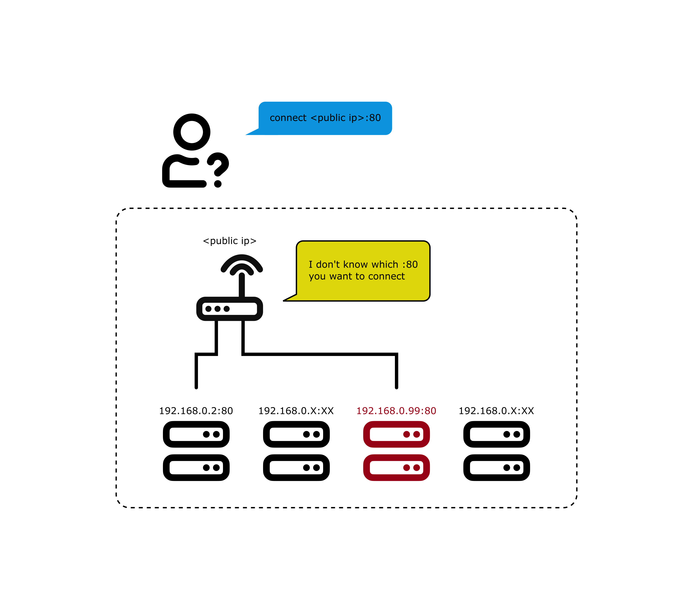

[](https://github.com/xiahualiu/wg_gaming_installer/actions/workflows/shellcheck.yml)

# WireGuard installer for Gaming

**Thank you for all the stars!**

This project is a bash script designed to set up a [WireGuard VPN](https://www.wireguard.com/) tailored for personal gaming or torrenting use. It now supports multiple WireGuard peers!

## Update Logs

- 09/29/2024 Major update.
    - Added multi-peer support.

- 09/23/2024 Major update.
    - Added support for OpenVZ, LXC by installing wireguard-go.
    - Switched from legacy `iptables` to `nftables` rules.
    - Added shellcheck GitHub Action.

- 10/08/2025 Minor update.
    - Added an extra SNAT rule to the server nftable rules.
        - The WG on the client side now only tunnels reply packets to WG server.
        - Normal network traffic is no longer affected by the WG tunnel.
    - Better `sysctl` control when turning on/off the WG service.

## What it does

#### Before using WireGuard



#### After using WireGuard


### NAT Improvement

Clients connecting to the VPN will immediately achieve a **Full Cone** NAT, the optimal network type for gaming and torrenting. To check your NAT type on Windows 10, use [NatTypeTester](https://github.com/HMBSbige/NatTypeTester)).

With this script, you don’t need to enable port forwarding on your router or use DMZ settings. All the magic happens within WireGuard. Simply put:

>The local ports will be forwarded directly to the server.

This solves connection problems caused by strict NAT in scenarios like:

1. Hosting a Minecraft, Terraria, or other game server online to play with friends, without needing to configure port forwarding on your router or if your ISP doesn’t provide a public IP.
2. Playing P2P games like Monster Hunter: World or Overcooked! where NAT restrictions prevent connections with other players.

For the best gaming experience, choose a server close to your region with low ping. Test the provider’s datacenter IP using their looking glass before purchasing a VPS.

## Port Forwarding

The script port forwards client ports to corresponding ports on the server. **Ensure no other applications (like SSH) are using these ports on the server**, as this will interfere with any applications listening on those ports. It’s highly recommended to run this script on a fresh, empty system.

The script supports both IPv4 and IPv6.

### Customize `nftables` rules

You can customize the `nftables` rules by editing the `add-fullcone-nat.sh` file **before** running the installer script.

If you need to edit the firewall rules after installation, the configuration file is located at `/etc/wireguard/add-fullcone-nat.sh`.

* Stop the WireGuard service (via the script menu) before editing this file.
* Do not remove or modify comments in this file.

For detailed explanations of these nftables rules, refer to the blog post: [Understand routing and NAT with WireGuard VPN](https://xiahua.pages.dev/wg-route-nat/)

## Requirements

Supported distributions:

- Debian >= 11
- Ubuntu >= 20.04 (*Preferred*)
- AlmaLinux
- RockyLinux
- ArchLinux
- Fedora

The script should work on any OS that supports nftables. More Linux distributions will be supported in the future after testing.

It supports both KVM and OpenVZ/LXC virtualization types.

For **OpenVZ** and **LXC** machines, [`wireguard-go`](https://github.com/WireGuard/wireguard-go) will be installed instead of the kernel WireGuard module. You’ll need to enable the TUN/TAP driver via your provider’s management panel.

## Usage

### Step 1: Upgrade Your OS

Since WireGuard is a kernel module, you **must** upgrade the kernel to the latest version and reboot your server.

```bash
# If you are using Ubuntu/Debian, etc
sudo apt update && sudo apt upgrade -y

# If you are using Fedora, AlmaLinux, etc
sudo dnf update -y

# Arch, etc.
sudo pacman -Syu

# Reboot once
sudo reboot
```

### Step 2: Download and Run the Script.

Download and execute the script. The user running the script must have `sudo` privileges.

Answer the questions prompted by the script, and it will handle the rest. For most VPS providers, you can simply press Enter through all the questions.

```bash
git clone https://github.com/xiahualiu/wg_gaming_installer.git
cd ./wg_gaming_installer
./install.sh
```

## Server Public IP Considerations 

This script requires a server with a public IP address.

Typically, the public IP is auto-detected. However, for some cloud providers like Google Cloud Platform or Oracle Cloud, the auto-detected IP might be a subnet IP (e.g., starting with `10.*.*.*`). In such cases, manually set the correct public IP.

## Handling `ip_local_reserved_ports`

For more details on why the script reserves forwarded ports, see [my blog post](https://xiahua.pages.dev/wg-route-nat/#reserve-dnat-ports).

On most KVM instances with newer kernels, the `net.ipv4.ip_local_reserved_ports` parameter is available, and the script will automatically reserve the ports. However, on older systems like OpenVZ or LXC instances, this parameter may not be available, and the script will display an error.

If you encounter such errors, ensure the forwarded ports are not within the system’s **Ephemeral Port Range**, as these ports are used for outgoing connections.

Check the ephemeral port range by:

```bash
sysctl net.ipv4.ip_local_port_range
```

## Managing WireGuard

Run the script again to access options like stopping, restarting, uninstalling, listing clients, or adding/removing a client.
