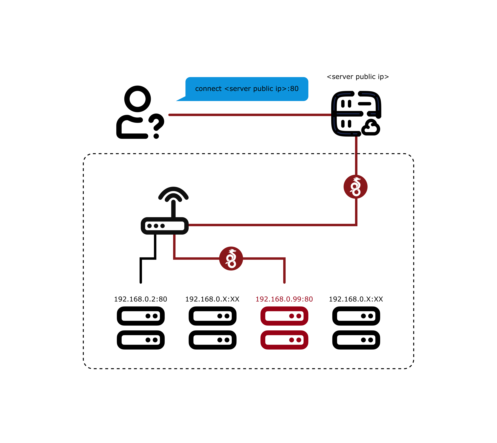

[](https://github.com/xiahualiu/wg_gaming_installer/actions/workflows/shellcheck.yml)
# WireGuard installer for Gaming

**Thank you for all the stars!**

**This project is a bash script that aims to setup a [WireGuard](https://www.wireguard.com/) VPN that is specified for PERSONAL gaming or torrenting use. It supports only ONE WireGuard client!**

You can share the client configuration file among multiple devices. However only one of the client can be active at the same time.

If you are looking for a common WireGuard install script that supports multi-client connections, i.e. multiple devices connect to the VPN at the same time, please visit [this repository](https://github.com/angristan/wireguard-install/) to continue.

## Update Logs

- 09/23/2024 Major update.
    - Added support for OpenVZ, LXC by installing wireguard-go.
    - Switched from legacy `iptables` to `nftables` rules.
    - Added shellcheck GitHub Action.

## What it does

#### Before using WireGuard


#### After using WireGuard



### NAT Improvement

Client connects to it will immediately achieve a **Full Cone** NAT, the optimal network type for gaming and torrenting. (How to check my NAT type in Win10 ? Use this tool [NatTypeTester](https://github.com/HMBSbige/NatTypeTester)).

With this script, you do not need to enable port forwarding on your router, you do not need the DMZ setting. All the magic happens inside Wireguard. Simply speaking: 

>The local ports will be forwarded to the server directly.

It solves connection problems due to strict NAT in these scenarios:

1. You want to host a Minecraft/Terraria, etc. server online and play with your friend, but you cannot figure out how to enable port forwarding on your router, or your ISP just did not give you a public IP address.

2. You play a P2P game like Monster Hunter: World or Overcooked! but your NAT type prevents you from connecting with other players. 

For a better gaming experience, the server should be close to your living region and has a low ping value. You should ping the provider's looking glass datacenter IP first before purchasing a VPS.

## Port Forwarding

The script **Port Forwards** the local port `53`, `88`, `80`, `500`(4 ports for XBOX LIVE) and `1024-65000` to the corresponding ports on the server side. These ports covered most of the ports used by any games. **Please make sure that there is no other application using these ports on the server, otherwise It will deafen any application that listens to these ports.** I highly suggest running this script on an new empty system. 

Specifically, if the SSH port is inside the range, the script will automatically move it to port `65432` for not losing access to the server after installation.

The script supports both IPv4 and IPv6.

WireGuard does not fit your environment? Check out [openvpn-install](https://github.com/angristan/openvpn-install).

## Customize the forwarding ports

After the installation, in `/etc/wireguard/add-fullcone-nat.sh` you can find:

```bash
nft add rule ip nat PREROUTING iifname $SERVER_PUB_NIC udp dport 53 counter dnat to $CLIENT_WG_IPV4:53 comment "WireGuardGamingInstaller" || true
nft add rule ip nat PREROUTING iifname $SERVER_PUB_NIC tcp dport 53 counter dnat to $CLIENT_WG_IPV4:53 comment "WireGuardGamingInstaller" || true
nft add rule ip nat PREROUTING iifname $SERVER_PUB_NIC udp dport 80 counter dnat to $CLIENT_WG_IPV4:80 comment "WireGuardGamingInstaller" || true
nft add rule ip nat PREROUTING iifname $SERVER_PUB_NIC tcp dport 80 counter dnat to $CLIENT_WG_IPV4:80 comment "WireGuardGamingInstaller" || true
nft add rule ip nat PREROUTING iifname $SERVER_PUB_NIC udp dport 88 counter dnat to $CLIENT_WG_IPV4:88 comment "WireGuardGamingInstaller" || true
nft add rule ip nat PREROUTING iifname $SERVER_PUB_NIC tcp dport 88 counter dnat to $CLIENT_WG_IPV4:88 comment "WireGuardGamingInstaller" || true
nft add rule ip nat PREROUTING iifname $SERVER_PUB_NIC udp dport 500 counter dnat to $CLIENT_WG_IPV4:500 comment "WireGuardGamingInstaller" || true
nft add rule ip nat PREROUTING iifname $SERVER_PUB_NIC tcp dport 500 counter dnat to $CLIENT_WG_IPV4:500 comment "WireGuardGamingInstaller" || true
nft add rule ip nat PREROUTING iifname $SERVER_PUB_NIC udp dport 1024-65000 counter dnat to $CLIENT_WG_IPV4:1024-65000 comment "WireGuardGamingInstaller" || true
nft add rule ip nat PREROUTING iifname $SERVER_PUB_NIC tcp dport 1024-65000 counter dnat to $CLIENT_WG_IPV4:1024-65000 comment "WireGuardGamingInstaller" || true
nft add rule ip6 nat PREROUTING iifname $SERVER_PUB_NIC udp dport 53 counter dnat to [$CLIENT_WG_IPV6]:53 comment "WireGuardGamingInstaller" || true
nft add rule ip6 nat PREROUTING iifname $SERVER_PUB_NIC tcp dport 53 counter dnat to [$CLIENT_WG_IPV6]:53 comment "WireGuardGamingInstaller" || true
nft add rule ip6 nat PREROUTING iifname $SERVER_PUB_NIC udp dport 80 counter dnat to [$CLIENT_WG_IPV6]:80 comment "WireGuardGamingInstaller" || true
nft add rule ip6 nat PREROUTING iifname $SERVER_PUB_NIC tcp dport 80 counter dnat to [$CLIENT_WG_IPV6]:80 comment "WireGuardGamingInstaller" || true
nft add rule ip6 nat PREROUTING iifname $SERVER_PUB_NIC udp dport 88 counter dnat to [$CLIENT_WG_IPV6]:88 comment "WireGuardGamingInstaller" || true
nft add rule ip6 nat PREROUTING iifname $SERVER_PUB_NIC tcp dport 88 counter dnat to [$CLIENT_WG_IPV6]:88 comment "WireGuardGamingInstaller" || true
nft add rule ip6 nat PREROUTING iifname $SERVER_PUB_NIC udp dport 500 counter dnat to [$CLIENT_WG_IPV6]:500 comment "WireGuardGamingInstaller" || true
nft add rule ip6 nat PREROUTING iifname $SERVER_PUB_NIC tcp dport 500 counter dnat to [$CLIENT_WG_IPV6]:500 comment "WireGuardGamingInstaller" || true
nft add rule ip6 nat PREROUTING iifname $SERVER_PUB_NIC udp dport 1024-65000 counter dnat to [$CLIENT_WG_IPV6]:1024-65000 comment "WireGuardGamingInstaller" || true
nft add rule ip6 nat PREROUTING iifname $SERVER_PUB_NIC tcp dport 1024-65000 counter dnat to [$CLIENT_WG_IPV6]:1024-65000 comment "WireGuardGamingInstaller" || true
```

If the game needs port that is not covered inside, you can modify the postup and postdown script yourself to add a certain port for it.

* Run the script and **STOP** the wireguard service.
* Modify `add-fullcone-nat.sh`, `rm-fullcone-nat.sh` according to your need.
* Run the script and **RESTART** the wireguard service.
 
## Requirements

Supported distributions:

- Debian >= 11
- Ubuntu >= 20.04 (*Preferred*)
- AlmaLinux
- RockyLinux
- ArchLinux
- Fedora

Theoretically any OS that supports `nftables` can run this script without too much trouble. It will support more Linux distributions in the future after I test them out one by one.

This script supports both **KVM** and **OpenVZ**, **LXC** machine virtualization types. 

For **OpenVZ**, **LXC** typed machine, [`wireguard-go`](https://github.com/WireGuard/wireguard-go) will be installed instead of the kernel WireGuard implementation.

In this case, you need to enable TUN/TAP driver on your provider's managment panal first.

## Usage

### 1st Step: Upgrade kernel version

Because WireGuard is a kernel module, you **MUST** upgrade the kernel to latest first and reboot your server once.

```bash
# If you are using Ubuntu/Debian, etc
sudo apt update && sudo apt upgrade -y

# If you are using Fedora, AlmaLinux, etc
sudo dnf update -y

# Arch, etc.
sudo pacman -Syu

# Reboot once
sudo reboot
```

### 2nd Step: Download and run the script.

Download and execute the script. Script user needs to be able to use `sudo` command.

Answer the questions asked by the script and it will take care of the rest. For most VPS providers, you can just enter through all the questions.

```bash
git clone https://github.com/xiahualiu/wg_gaming_installer.git
cd ./wg_gaming_installer
./install.sh
```

## Server Public IP problem

This script needs to run on a server with a public IP address to work.

Typically the server public IP should be populated automatically. However for some cloud providers like Google Cloud Platform and Oracle Cloud, the auto-populated public IP address is NOT the correct, but instead a subnet IP address (usually starts with `10.*.*.*`).

In these cases you need to change the value to what your server's acutal public IP is.

## Stop / Restart / Uninstall

Run the script again will give you these options!
